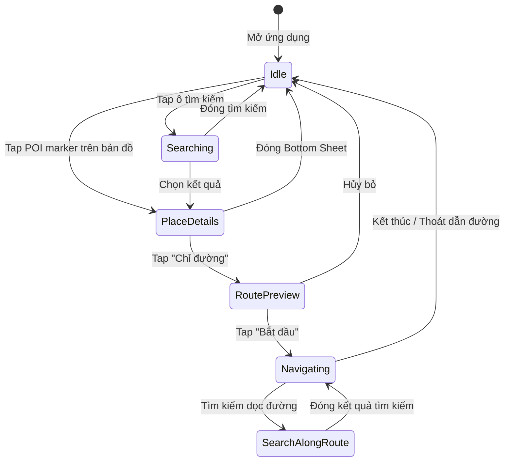

# Google Maps — Phân tích chi tiết Workflow Nghiệp vụ & Giao diện

> **Mục đích**: Tài liệu cơ sở để so sánh hành vi, nghiệp vụ và giao diện của **S-Map** với chuẩn mực ngành (**Google Maps**).
> Mỗi tính năng được mô tả theo trình tự: **Hành động người dùng → Phản hồi UI → Logic nghiệp vụ → Tương tác với các tính năng đang hoạt động khác**.

---

## Mục lục

1. [Trạng thái tổng quan (Global App States)](#1-trạng-thái-tổng-quan-global-app-states)
2. [Luồng 1: Khám phá Bản đồ (Map Exploration)](#2-luồng-1-khám-phá-bản-đồ-map-exploration)
3. [Luồng 2: Tìm kiếm (Search)](#3-luồng-2-tìm-kiếm-search)
4. [Luồng 3: Xem chi tiết Địa điểm (Place Details / POI)](#4-luồng-3-xem-chi-tiết-địa-điểm-place-details--poi)
5. [Luồng 4: Xem trước Lộ trình (Route Preview)](#5-luồng-4-xem-trước-lộ-trình-route-preview)
6. [Luồng 5: Dẫn đường Turn-by-Turn (Navigation)](#6-luồng-5-dẫn-đường-turn-by-turn-navigation)
7. [Luồng 6: Tải Bản đồ Ngoại tuyến (Offline Maps)](#7-luồng-6-tải-bản-đồ-ngoại-tuyến-offline-maps)
8. [Luồng 7: Địa điểm Đã lưu (Saved Places / Favorites)](#8-luồng-7-địa-điểm-đã-lưu-saved-places--favorites)
9. [Luồng 8: Cài đặt & Giao diện (Settings & Appearance)](#9-luồng-8-cài-đặt--giao-diện-settings--appearance)
10. [Ma trận Tương tác giữa các Luồng (Interaction Matrix)](#10-ma-trận-tương-tác-giữa-các-luồng-interaction-matrix)

---

## 1. Trạng thái tổng quan (Global App States)

Google Maps hoạt động dựa trên một **máy trạng thái (State Machine)** ngầm với các trạng thái chính sau:



### Quy tắc ưu tiên trạng thái

| Mức ưu tiên | Trạng thái | Mô tả |
|:---:|---|---|
| 🔴 Cao nhất | **Navigating** (Đang dẫn đường) | Không bao giờ bị gián đoạn bởi bất kỳ hành động nào khác. GPS tracking, voice guidance, off-route detection luôn hoạt động ngầm. |
| 🟠 Cao | **RoutePreview** (Xem trước lộ trình) | Bản đồ bị khóa theo viewport của lộ trình. Tìm kiếm mới sẽ hủy bỏ trạng thái này. |
| 🟡 Trung bình | **PlaceDetails** (Chi tiết địa điểm) | Bottom Sheet có thể bị đóng bằng thao tác vuốt xuống hoặc khi người dùng thao tác khác. |
| 🟢 Thấp | **Searching** (Đang tìm kiếm) | Overlay tìm kiếm che lên bản đồ, nhưng bản đồ vẫn render ngầm bên dưới. |
| ⚪ Mặc định | **Idle** (Nhàn rỗi) | Bản đồ toàn màn hình, hiển thị vị trí hiện tại, thanh tìm kiếm, và các category pills. |

---

## 2. Luồng 1: Khám phá Bản đồ (Map Exploration)

### 2.1. Trạng thái Idle — Bản đồ chính

| Bước | Hành động người dùng | UI phản hồi | Nghiệp vụ xử lý |
|:---:|---|---|---|
| 1 | Mở ứng dụng | Hiển thị bản đồ toàn màn hình, camera đặt tại vị trí hiện tại (GPS). Thanh tìm kiếm ở đầu trang, các category pills ("Nhà hàng", "Xăng dầu", "Cà phê"...) bên dưới. | Khởi tạo GPS Listener, tải Map Tiles cho vùng nhìn hiện tại, tải POI markers cho viewport. |
| 2 | Kéo/zoom bản đồ | Camera di chuyển mượt theo hướng kéo. Map tiles mới được tải lazy-load khi viewport thay đổi. POI markers cập nhật theo khu vực mới. | Gửi request tile mới dựa trên bounding box mới. Debounce 300ms trước khi tải POI markers mới. |
| 3 | Tap nút "Vị trí hiện tại" (GPS crosshair) | Camera animate mượt mà về vị trí GPS hiện tại. Nút chuyển thành mũi tên la bàn nếu tap lần 2. | Lấy tọa độ GPS mới nhất, animate camera về đó. Tap lần 2: kích hoạt chế độ la bàn (camera xoay theo hướng thiết bị). |
| 4 | Tap vào một POI marker trên bản đồ | → Chuyển sang **PlaceDetails** (xem [Luồng 3](#4-luồng-3-xem-chi-tiết-địa-điểm-place-details--poi)) | POI marker được highlight, Bottom Sheet compact xuất hiện. |

### 2.2. Khi các nghiệp vụ khác đang hoạt động

| Nghiệp vụ đang chạy | Hành vi Map Exploration |
|---|---|
| **Đang dẫn đường (Navigating)** | Bản đồ vẫn có thể kéo/zoom tạm thời, nhưng sau 5 giây không tương tác sẽ tự snap lại vị trí GPS + hướng di chuyển. Nút "Re-center" xuất hiện để quay về chế độ theo dõi. |
| **Đang tải Offline Map** | Map Exploration hoạt động bình thường. Thanh tiến trình tải xuất hiện dạng notification nhỏ, không ảnh hưởng giao diện bản đồ. |
| **Đang tìm kiếm** | Bản đồ bị mờ nhẹ (dim) phía sau overlay tìm kiếm. Khi đóng tìm kiếm, bản đồ khôi phục trạng thái cũ. |

---

## 3. Luồng 2: Tìm kiếm (Search)

### 3.1. Luồng chính

| Bước | Hành động người dùng | UI phản hồi | Nghiệp vụ xử lý |
|:---:|---|---|---|
| 1 | Tap vào thanh tìm kiếm | Thanh tìm kiếm mở rộng thành ô nhập liệu full-width. Bàn phím hiện ra. Hiển thị danh sách **Tìm kiếm Gần đây** (Recent Searches) và **Gợi ý** bên dưới. Bản đồ bị mờ nhẹ. | Load lịch sử tìm kiếm từ local storage. |
| 2 | Gõ ký tự đầu tiên | Gợi ý autocomplete xuất hiện ngay lập tức dưới ô nhập, cập nhật realtime theo từng ký tự. Mỗi gợi ý hiển thị tên địa điểm, loại (nhà hàng, trạm xăng...) và khoảng cách ước tính. | **Debounce 300ms** → Gửi request Autocomplete API (Places API) với query + tọa độ hiện tại làm bias. Sắp xếp kết quả theo: (1) Relevance, (2) Distance, (3) Popularity. |
| 3 | Tiếp tục gõ | Danh sách gợi ý cập nhật mượt mà (animated list diff). Kết quả cũ fade out, kết quả mới fade in. | Hủy request API trước đó (cancel token), gửi request mới. Không gửi quá 1 request trong 300ms. |
| 4a | Tap chọn một gợi ý | Bàn phím đóng. Overlay tìm kiếm biến mất. Camera animate đến vị trí POI. → Chuyển sang **PlaceDetails**. | Lưu query vào Recent Searches. Fetch Place Details (tên, ảnh, giờ mở cửa, đánh giá...). |
| 4b | Nhấn Enter / nút Tìm | Bàn phím đóng. Hiển thị kết quả trên bản đồ dạng nhiều markers đỏ. Phía dưới có BottomSheet dạng carousel nằm ngang với các kết quả. | Gửi Places Search API. Kết quả trả về được render thành markers trên bản đồ. Camera zoom fit để hiển thị toàn bộ markers. |
| 5 | Tap nút "X" hoặc nút Back | Đóng overlay tìm kiếm. Bản đồ khôi phục trạng thái trước đó. | Hủy mọi request API đang pending. Xóa markers kết quả tìm kiếm khỏi bản đồ. |

### 3.2. Tìm kiếm theo danh mục (Category Pills)

| Bước | Hành động | UI | Nghiệp vụ |
|:---:|---|---|---|
| 1 | Tap pill "Nhà hàng" | Pill được highlight. Bản đồ hiển thị các markers nhà hàng trong viewport hiện tại. Bottom carousel hiện danh sách kết quả. | Viewport Search: Tìm POI theo category trong bounding box hiện tại. Khi kéo bản đồ ra vùng mới, nút "Tìm kiếm ở khu vực này" xuất hiện. |
| 2 | Kéo bản đồ sang vùng mới | Nút nổi "Tìm kiếm ở khu vực này" ("Search this area") xuất hiện giữa màn hình. | Không tự động tìm kiếm lại (tiết kiệm API calls). Chờ người dùng xác nhận. |
| 3 | Tap "Tìm kiếm ở khu vực này" | Markers cũ biến mất, markers mới xuất hiện. Carousel cập nhật. | Gửi API search mới với bounding box mới. |

### 3.3. Khi các nghiệp vụ khác đang hoạt động

| Nghiệp vụ đang chạy | Hành vi Search |
|---|---|
| **Đang dẫn đường** | Tìm kiếm chuyển sang chế độ **"Search Along Route"** (Tìm dọc đường). Kết quả được lọc theo buffer 5km quanh lộ trình đang đi. Dẫn đường KHÔNG bị gián đoạn, voice guidance vẫn phát âm bình thường. |
| **Đang xem PlaceDetails** | Bottom Sheet PlaceDetails bị đóng. Chuyển sang overlay tìm kiếm. |
| **Đang Route Preview** | Route Preview bị hủy bỏ. Lộ trình vẽ trên bản đồ bị xóa. Chuyển sang overlay tìm kiếm. |

---

## 4. Luồng 3: Xem chi tiết Địa điểm (Place Details / POI)

### 4.1. Luồng chính (Progressive Disclosure)

| Bước | Hành động | UI | Nghiệp vụ |
|:---:|---|---|---|
| 1 | Tap POI marker trên bản đồ HOẶC chọn kết quả tìm kiếm | **Bottom Sheet Compact** trượt lên từ đáy màn hình (~25% chiều cao). Hiển thị: Tên, Rating (⭐), Loại hình, Trạng thái mở/đóng cửa, Khoảng cách. Các nút CTA nhanh: **"Chỉ đường"**, **"Gọi"**, **"Lưu"**, **"Chia sẻ"**. POI marker trên bản đồ được highlight (phóng to + đổi màu). Camera animate nhẹ để POI nằm giữa phần bản đồ còn lại. | Fetch Place Details API (ảnh, reviews, giờ hoạt động...). Dùng skeleton loader trong khi chờ API trả về. |
| 2 | Vuốt Bottom Sheet lên (kéo lên) | Bottom Sheet mở rộng lên **~80% chiều cao** (hoặc full-screen). Hiển thị thêm: Ảnh carousel, Đánh giá & Reviews, Giờ hoạt động chi tiết, Địa chỉ đầy đủ, Website, Danh mục. | Lazy-load ảnh gallery. Fetch thêm reviews nếu cần. |
| 3 | Vuốt Bottom Sheet xuống | Thu gọn về dạng Compact hoặc đóng hoàn toàn. | Không hủy bất kỳ dữ liệu nào (cache lại để mở lại nhanh). |
| 4a | Tap "Chỉ đường" | → Chuyển sang **RoutePreview** (xem [Luồng 4](#5-luồng-4-xem-trước-lộ-trình-route-preview)) | Gửi Directions API với origin = vị trí GPS, destination = POI này. |
| 4b | Tap "Lưu" (bookmark) | Icon bookmark chuyển từ outline → filled. Popup nhỏ hiện lên cho chọn danh sách: "Yêu thích", "Muốn đến", "Danh sách tùy chỉnh". | Lưu POI vào danh sách đã chọn (sync cloud + local). |
| 4c | Tap "Chia sẻ" | Share sheet hệ thống hiện ra với link Google Maps của POI. | Tạo shareable link chứa Place ID. |

### 4.2. Khi các nghiệp vụ khác đang hoạt động

| Nghiệp vụ đang chạy | Hành vi PlaceDetails |
|---|---|
| **Đang dẫn đường** | Bottom Sheet vẫn hiển thị nhưng ở dạng nhỏ hơn. Panel dẫn đường (chỉ dẫn rẽ) thu gọn tạm thời nhưng voice guidance vẫn phát âm. Nút "Chỉ đường" chuyển thành "Thêm điểm dừng" (Add stop). |
| **Đang Route Preview** | Route Preview bị ẩn tạm. Nút "Chỉ đường" tính lộ trình tới POI mới (thay thế destination cũ). |

---

## 5. Luồng 4: Xem trước Lộ trình (Route Preview)

### 5.1. Luồng chính

| Bước | Hành động | UI | Nghiệp vụ |
|:---:|---|---|---|
| 1 | Tap "Chỉ đường" từ PlaceDetails hoặc Search | Giao diện chuyển sang **Route Preview Mode**: <br>• Top bar: Ô nhập "Từ" (mặc định: Vị trí hiện tại) và "Đến" (destination). <br>• Giữa: Bản đồ hiển thị **đường polyline** của lộ trình tối ưu (xanh dương đậm) + các lộ trình thay thế (xám). <br>• Bottom bar: Thời gian di chuyển, Khoảng cách, Tình trạng giao thông (xanh/vàng/đỏ trên đường). <br>• Tab chọn phương tiện: 🚗 Xe hơi, 🚌 Công cộng, 🚶 Đi bộ, 🚲 Xe đạp, 🚕 Gọi xe. | Gửi Directions API cho tất cả phương tiện (song song). Hiển thị kết quả nhanh nhất trước. Lộ trình tối ưu dựa trên: thời gian thực, giao thông hiện tại, lịch sử giao thông cùng giờ. |
| 2 | Tap lộ trình thay thế (xám) trên bản đồ | Lộ trình đó chuyển thành xanh dương (được chọn). Lộ trình cũ chuyển thành xám. Bottom bar cập nhật thời gian/khoảng cách mới. | Không gọi API mới, chỉ swap dữ liệu route đã cache. |
| 3 | Chuyển tab phương tiện (ví dụ: 🚶 Đi bộ) | Polyline vẽ lại cho phương tiện mới. Thời gian/khoảng cách cập nhật. Một số phương tiện có thêm thông tin: <br>• 🚌 Công cộng: Hiện các tuyến bus/metro cụ thể, giờ khởi hành gần nhất. <br>• 🚕 Gọi xe: Hiện ước tính giá + thời gian chờ. | Lấy dữ liệu đã cache hoặc gọi API mới nếu chưa cache. |
| 4 | Tap nút **"Bắt đầu" (Start)** | → Chuyển sang **Navigation Turn-by-Turn** (xem [Luồng 5](#6-luồng-5-dẫn-đường-turn-by-turn-navigation)) | Kích hoạt Navigation Service (foreground service + notification). Bắt đầu GPS tracking ở tần suất cao (1 lần/giây). |
| 5 | Tap "Tùy chọn đường" (Route Options) | Dialog hiện ra với các toggle: "Tránh đường cao tốc", "Tránh phí cầu đường", "Tránh phà". | Gọi lại Directions API với các tham số `avoid` tương ứng. Vẽ lại lộ trình. |
| 6 | Đảo điểm đi/đến (Swap) | Ô "Từ" và "Đến" hoán đổi giá trị (animated). Polyline vẽ lại theo chiều ngược lại. | Gọi Directions API mới với origin/destination đảo ngược. |

### 5.2. Khi các nghiệp vụ khác đang hoạt động

| Nghiệp vụ đang chạy | Hành vi Route Preview |
|---|---|
| **Đang tải Offline Map** | Không ảnh hưởng. Tiến trình tải chạy ngầm. |
| **Search mới** | Route Preview bị **hủy hoàn toàn**. Polyline bị xóa. Chuyển sang Search. |
| **PlaceDetails mới** | Route Preview bị hủy. Destination có thể bị thay thế bằng POI mới. |

---

## 6. Luồng 5: Dẫn đường Turn-by-Turn (Navigation)

> ⚠️ **Đây là trạng thái có ưu tiên cao nhất trong toàn bộ ứng dụng.** Không có hành động nào được phép gián đoạn Navigation.

### 6.1. Luồng chính

| Bước | Hành động | UI | Nghiệp vụ |
|:---:|---|---|---|
| 1 | Tap "Bắt đầu" từ Route Preview | **Chuyển đổi giao diện toàn bộ**: <br>• Bản đồ chuyển sang chế độ **3D Perspective** (nhìn nghiêng theo hướng di chuyển). <br>• Camera tự động theo GPS, tự xoay theo hướng di chuyển (heading). <br>• Top bar: Hướng dẫn rẽ tiếp theo (biểu tượng mũi tên + tên đường + khoảng cách). <br>• Bottom bar: ETA (giờ đến dự kiến), Thời gian còn lại, Khoảng cách còn lại. <br>• Nút: Thu nhỏ, Tắt tiếng, Tìm kiếm dọc đường, Menu. <br>• **Thanh tiến trình** dọc bên phải hiển thị lộ trình tổng thể + vị trí hiện tại. | Khởi động **Foreground Service** (Android) / **Background Location** (iOS). GPS tracking 1Hz. Notification cố định hiển thị chỉ dẫn rẽ + ETA. Kích hoạt Text-to-Speech engine cho voice guidance. |
| 2 | Di chuyển theo lộ trình | Camera tự động theo vị trí GPS, xoay mượt mà theo heading. <br>• Khi sắp đến nơi rẽ: Hiệu ứng zoom-in + mũi tên lớn dần + giọng nói "Sau 200m, rẽ phải". <br>• Làn đường được highlight trên bản đồ (lane guidance). <br>• Thanh tiến trình (progress bar) bên phải di chuyển theo. | **Liên tục**: (1) Cập nhật vị trí trên polyline, (2) Tính khoảng cách đến lệnh rẽ tiếp theo, (3) Cập nhật ETA dựa trên tốc độ thực tế + giao thông, (4) Voice guidance phát tại các ngưỡng: 1km, 500m, 200m, 50m trước điểm rẽ. |
| 3 | **Lệch đường (Off-route)** | Giọng nói: "Đang tính toán lại lộ trình...". <br>Polyline cũ fade out. Vòng xoay loading nhỏ xuất hiện. Polyline mới fade in sau 1-3 giây. ETA cập nhật. | **Off-route detection**: Nếu vị trí GPS cách polyline > **30m** trong **3 giây liên tục** → trigger reroute. <br>Gọi Directions API mới với origin = vị trí hiện tại, destination giữ nguyên. Nếu offline: sử dụng Offline Routing Engine. |
| 4 | **Giao thông thay đổi** | Nếu có đường nhanh hơn: Banner thông báo "Có đường nhanh hơn, tiết kiệm 5 phút" trượt xuống từ trên. Nút "Nhận lộ trình mới" / "Bỏ qua". | Hệ thống liên tục kiểm tra Traffic API mỗi **2-5 phút**. So sánh ETA hiện tại vs lộ trình thay thế. Nếu tiết kiệm > 5% thời gian → đề xuất reroute. Một số trường hợp tự động reroute mà không hỏi. |
| 5 | Kéo/zoom bản đồ (tay tương tác) | Camera tạm dừng theo dõi GPS. Nút "Re-center" (quay về vị trí hiện tại) xuất hiện góc dưới phải. Voice guidance vẫn tiếp tục phát âm. | GPS tracking vẫn hoạt động ngầm. Sau **5 giây** không tương tác → tự động re-center. |
| 6 | Tap "Tìm kiếm dọc đường" (Search along route) | Overlay tìm kiếm hiện ra với các category nhanh: ⛽ Xăng, ☕ Cà phê, 🍔 Ăn uống, 🅿️ Đỗ xe. Kết quả hiển thị dọc theo lộ trình, kèm thời gian detour (+ bao nhiêu phút). | Search API gửi kèm polyline lộ trình. Kết quả được lọc trong buffer **5km quanh lộ trình**. Khoảng cách/thời gian detour được tính dựa trên vị trí trên lộ trình, KHÔNG phải đường chim bay. |
| 7 | Chọn điểm dừng từ kết quả "Tìm dọc đường" | Lộ trình cập nhật: Polyline vẽ lại qua điểm dừng → tiếp tục đến destination. ETA cập nhật. | Gọi Directions API với waypoint mới. Lộ trình mới = origin → waypoint → destination. |
| 8 | Tap **"Thoát dẫn đường"** (Exit) | Dialog xác nhận: "Bạn muốn dừng dẫn đường?". <br>• "Có": Tắt Navigation, quay về **Idle**. <br>• "Không": Tiếp tục dẫn đường. | Dừng Foreground Service, xóa notification, tắt GPS tracking tần suất cao, tắt voice guidance. Camera quay về chế độ 2D top-down. |
| 9 | **Đến nơi** (Arrival) | Giọng nói: "Bạn đã đến điểm đến". Biểu tượng cờ xuất hiện trên bản đồ tại destination. Giao diện Navigation tự động đóng sau 5 giây. Chuyển về **Idle**. | Dừng tất cả service. Lưu chuyến đi vào **Timeline** (nếu bật). Gợi ý đánh giá địa điểm. |

### 6.2. Xử lý lỗi & Edge Cases trong Navigation

| Tình huống | UI phản hồi | Nghiệp vụ xử lý |
|---|---|---|
| **Mất GPS (đi vào hầm)** | Thông báo nhỏ "GPS yếu". Vị trí ước tính bằng Dead Reckoning (gyroscope + accelerometer + tốc độ cuối cùng). Chấm vị trí nhấp nháy thay vì sáng liên tục. | Dùng sensor fusion: gyro + accelerometer + last known speed để ước tính vị trí. KHÔNG trigger reroute khi mất GPS. |
| **Mất mạng giữa chừng** | Nếu có Offline Maps cho vùng đó: Dẫn đường tiếp bình thường (offline routing). Nếu không: Banner "Không có kết nối mạng. Dẫn đường có thể bị ảnh hưởng." | Chuyển sang Offline Routing Engine nếu có dữ liệu. Traffic overlay bị tắt. ETA chỉ dựa trên khoảng cách + tốc độ trung bình. |
| **App bị kill / điện thoại restart** | Notification hệ thống: "Đang dẫn đường đến [Destination]". Tap vào mở lại app, resume navigation. | Foreground Service giữ navigation state sống. Khi mở lại app: Restore route + current position → tiếp tục navigation liền mạch. |
| **Cuộc gọi đến** | Navigation thu nhỏ thành Picture-in-Picture (Android) hoặc notification. Voice guidance tạm dừng trong khi gọi. Sau khi kết thúc cuộc gọi: Navigation tự resume. | Audio focus chuyển cho cuộc gọi. Sau khi gọi xong: Reclaim audio focus, phát lại chỉ dẫn rẽ tiếp theo. |

### 6.3. Chế độ Day / Night trong Navigation

| Điều kiện | Hành vi |
|---|---|
| **Automatic (mặc định)** | Bản đồ tự chuyển từ Light → Dark theme dựa trên giờ mặt trời (sunset/sunrise) tại vị trí GPS hiện tại. Chuyển đổi mượt mà (fade transition ~500ms). |
| **Day cố định** | Luôn dùng bản đồ sáng, bất kể giờ. |
| **Night cố định** | Luôn dùng bản đồ tối, bất kể giờ. |

---

## 7. Luồng 6: Tải Bản đồ Ngoại tuyến (Offline Maps)

### 7.1. Phương pháp 1: Tải từ trang Chi tiết Địa điểm

| Bước | Hành động | UI | Nghiệp vụ |
|:---:|---|---|---|
| 1 | Tìm kiếm một thành phố (ví dụ: "Đà Nẵng") | Hiển thị PlaceDetails cho thành phố. | Fetch Place Details. |
| 2 | Tap menu "⋮" → "Tải bản đồ ngoại tuyến" | Màn hình chọn vùng xuất hiện: Khung chữ nhật có thể zoom/pan trên bản đồ. Hiển thị **ước tính dung lượng** ("~150 MB"). | Tính toán dung lượng dựa trên zoom level + diện tích vùng chọn. |
| 3 | Điều chỉnh vùng (zoom/pan khung) | Dung lượng ước tính cập nhật realtime. Cảnh báo nếu vùng quá lớn ("Vùng chọn lớn hơn giới hạn cho phép"). | Giới hạn max ~30,000 km². |
| 4 | Tap "Tải xuống" | Quay về bản đồ. Notification + thanh tiến trình trong phần "Bản đồ ngoại tuyến" (Settings). | Bắt đầu download tiles + POI data + routing graph cho vùng đã chọn. Chạy dưới nền (background download). |

### 7.2. Phương pháp 2: Quản lý từ Settings

| Bước | Hành động | UI | Nghiệp vụ |
|:---:|---|---|---|
| 1 | Profile → "Bản đồ ngoại tuyến" | Danh sách các bản đồ đã tải. Mỗi mục: Tên, Dung lượng, Ngày hết hạn, Thanh tiến trình (nếu đang tải). Nút "Chọn bản đồ của bạn" (Select your own map). | Load danh sách offline maps từ local DB. |
| 2 | Tap "Chọn bản đồ của bạn" | Giống bước 2 ở phương pháp 1. | Tương tự. |
| 3 | Tap vào một bản đồ đã tải | Hiển thị chi tiết: Tên (có thể đổi tên), Dung lượng, Ngày cập nhật cuối, Ngày hết hạn. Nút: "Cập nhật", "Xóa". | Kiểm tra xem có update không (so sánh version). |
| 4 | Tap "Xóa" | Dialog xác nhận: "Xóa bản đồ ngoại tuyến?". OK → Xóa khỏi thiết bị. | Xóa tiles + POI + routing data khỏi local storage. Giải phóng dung lượng. |

### 7.3. Auto-update & Hết hạn

| Tình huống | Hành vi |
|---|---|
| **Auto-update (mặc định BẬT)** | Cứ mỗi **15 ngày**, khi có WiFi + đang sạc → tự động tải lại dữ liệu mới cho các vùng đã lưu. |
| **Sắp hết hạn (< 3 ngày)** | Notification: "Bản đồ ngoại tuyến [Tên] sắp hết hạn. Kết nối WiFi để cập nhật." |
| **Đã hết hạn** | Badge cảnh báo trên mục bản đồ. Bản đồ offline vẫn hoạt động nhưng dữ liệu có thể lỗi thời. |

### 7.4. Khi các nghiệp vụ khác đang hoạt động

| Nghiệp vụ đang chạy | Hành vi Offline Maps Download |
|---|---|
| **Đang dẫn đường** | Tải bản đồ chạy ngầm, **KHÔNG ảnh hưởng** Navigation. Có thể bị giảm băng thông (lower priority). |
| **Mất mạng** | Tải tạm dừng (Pause). Tự động resume khi có mạng lại. Thanh tiến trình hiện "Đang chờ kết nối...". |
| **Bộ nhớ đầy** | Cảnh báo: "Không đủ dung lượng để tải bản đồ ngoại tuyến". Gợi ý xóa bản đồ cũ hoặc dữ liệu không cần thiết. |

---

## 8. Luồng 7: Địa điểm Đã lưu (Saved Places / Favorites)

### 8.1. Lưu địa điểm

| Bước | Hành động | UI | Nghiệp vụ |
|:---:|---|---|---|
| 1 | Từ PlaceDetails, tap nút "Lưu" (🔖) | Icon chuyển từ outline → filled. Popup chọn danh sách: <br>• ⭐ Đã gắn sao (Starred) — Mặc định <br>• ❤️ Yêu thích (Favorites) <br>• 📌 Muốn đến (Want to go) <br>• ➕ Tạo danh sách mới | Lưu vào cloud + local cache. Sync xuyên thiết bị qua Google Account. |
| 2 | Chọn danh sách hoặc tạo mới | Popup đóng. Toast: "Đã lưu vào [Tên danh sách]". | Write vào cả local DB (Hive/SQLite tương đương) + Cloud API. |
| 3 | Tap lại nút "Lưu" (đã lưu rồi) | Popup hiện lại, cho phép bỏ chọn danh sách (unsave) hoặc chuyển danh sách khác. | Xóa/thay đổi mapping POI ↔ danh sách. |

### 8.2. Quản lý danh sách

| Bước | Hành động | UI | Nghiệp vụ |
|:---:|---|---|---|
| 1 | Tab "Bạn" (You) → "Đã lưu" (Saved) | Hiển thị grid các danh sách. Mỗi danh sách: Tên, Số lượng mục, Ảnh bìa (auto-generated từ ảnh các POI). | Load danh sách từ cloud. |
| 2 | Tap vào một danh sách | Hiển thị toàn bộ POI trong danh sách, sắp xếp theo: Thêm gần đây nhất hoặc Khoảng cách. Có thể xem trên bản đồ (hiển thị tất cả markers). | Fetch danh sách POI + metadata. |
| 3 | Menu "⋮" trên danh sách | Tùy chọn: Đổi tên, Chia sẻ, Xóa danh sách, Ẩn/Hiện trên bản đồ. | Cập nhật metadata danh sách. |

### 8.3. Hiển thị trên bản đồ

| Cài đặt | Hành vi |
|---|---|
| **Hiện trên bản đồ (mặc định)** | Các POI đã lưu hiển thị dạng marker nhỏ trên bản đồ khi zoom đủ gần. Marker có icon tương ứng với loại danh sách (⭐, ❤️, 📌). |
| **Ẩn trên bản đồ** | Markers biến mất khỏi bản đồ nhưng POI vẫn còn trong danh sách. |

---

## 9. Luồng 8: Cài đặt & Giao diện (Settings & Appearance)

### 9.1. Cấu trúc Settings

```
Profile Picture → Settings
├── App & Display
│   ├── Theme: Light / Dark / System Default
│   ├── Đơn vị: km / dặm
│   └── Ngôn ngữ ứng dụng
├── Navigation
│   ├── Chế độ màu: Day / Night / Automatic
│   ├── Giọng nói: Tắt / Chỉ cảnh báo / Bật đầy đủ
│   ├── Tránh đường: Cao tốc / Phí / Phà
│   └── Chế độ Speedometer: Bật / Tắt
├── Bản đồ ngoại tuyến
│   ├── Danh sách bản đồ đã tải
│   ├── Cài đặt tự động cập nhật
│   └── Cài đặt tải qua Wi-Fi only
├── Thông báo
│   ├── Cập nhật giao thông
│   ├── Gợi ý địa điểm
│   └── Nhắc nhở cập nhật bản đồ
└── Dữ liệu & Quyền riêng tư
    ├── Xóa lịch sử tìm kiếm
    ├── Tắt/bật Timeline
    └── Google Location History
```

### 9.2. Khi thay đổi Settings ảnh hưởng đến nghiệp vụ đang chạy

| Cài đặt thay đổi | Ảnh hưởng | Thời điểm áp dụng |
|---|---|---|
| Theme Dark ↔ Light | Toàn bộ giao diện app thay đổi. | **Ngay lập tức** (không cần restart). |
| Chế độ màu Navigation | Chỉ ảnh hưởng khi đang trong Navigation. | Áp dụng cho **lần dẫn đường tiếp theo** hoặc **ngay lập tức** nếu đang navigating. |
| Tránh đường cao tốc | Ảnh hưởng tính toán lộ trình. | Áp dụng cho **lần Route Preview tiếp theo**. Nếu đang navigating → cần tap "Reroute" thủ công. |
| Đơn vị km ↔ dặm | Thay đổi tất cả hiển thị khoảng cách. | **Ngay lập tức** trên toàn app. |
| Giọng nói Navigation | Thay đổi voice guidance. | **Ngay lập tức** nếu đang navigating. |

---

## 10. Ma trận Tương tác giữa các Luồng (Interaction Matrix)

> Ma trận này mô tả: **Khi Luồng A đang hoạt động, nếu kích hoạt Luồng B thì Luồng A sẽ phản ứng như thế nào?**

| ↓ Đang chạy \ Kích hoạt → | Map Explore | Search | Place Details | Route Preview | Navigation | Offline Download | Save Place |
|---|:---:|:---:|:---:|:---:|:---:|:---:|:---:|
| **Map Explore (Idle)** | — | UI dim, overlay search | Bottom Sheet compact | Full takeover | Full takeover | Chạy ngầm | Toast nhỏ |
| **Search** | Đóng search | — | Đóng search, mở Details | Đóng search, vẽ route | ❌ Không thể | Không ảnh hưởng | Toast nhỏ |
| **Place Details** | Đóng Details | Đóng Details, mở Search | Thay thế Details | Đóng Details, mở Route | ❌ Không thể | Không ảnh hưởng | Icon animate |
| **Route Preview** | **Hủy bỏ** Route | **Hủy bỏ** Route, mở Search | **Hủy bỏ** Route, mở Details | Thay thế route | Chuyển sang Nav | Không ảnh hưởng | ❌ Không liên quan |
| **Navigation** | Tạm dừng camera tracking | Search Along Route | Details compact (thêm điểm dừng) | ❌ Không thể | — | Giảm priority tải | Thêm điểm dừng |
| **Offline Download** | Không ảnh hưởng | Không ảnh hưởng | Không ảnh hưởng | Không ảnh hưởng | Giảm priority | — | Không ảnh hưởng |
| **Save Place** | Không ảnh hưởng | Không ảnh hưởng | Cập nhật icon | Không ảnh hưởng | Không ảnh hưởng | Không ảnh hưởng | — |

### Chú giải Ma trận

| Ký hiệu | Ý nghĩa |
|:---:|---|
| **—** | Không áp dụng (cùng luồng) |
| **Đóng X** | Luồng X bị đóng/ẩn để nhường cho luồng mới |
| **Hủy bỏ** | Luồng bị hủy hoàn toàn, mất dữ liệu tạm |
| **Chạy ngầm** | Luồng tiếp tục chạy dưới nền, không ảnh hưởng UI |
| **Tạm dừng** | Luồng tạm ngưng một phần (ví dụ: camera tracking) nhưng vẫn hoạt động |
| **Giảm priority** | Luồng vẫn chạy nhưng bị giảm mức ưu tiên tài nguyên |
| **❌ Không thể** | Hành động không khả dụng trong trạng thái hiện tại |

---

## Phụ lục: Các nguyên tắc UX cốt lõi của Google Maps

### A. Hierarchy of Priority (Thứ tự ưu tiên)

```
Navigation (Safety-critical) 
  > Route Preview 
    > Place Details 
      > Search 
        > Map Exploration (Idle)
```

Trạng thái có ưu tiên cao hơn **không bao giờ bị gián đoạn** bởi trạng thái có ưu tiên thấp hơn. Ngược lại, trạng thái ưu tiên cao có thể **hủy bỏ hoặc thu gọn** trạng thái ưu tiên thấp.

### B. Progressive Disclosure (Tiết lộ từng bước)

Thông tin chỉ hiển thị khi cần thiết, theo thứ tự:
1. **Compact** → Tên + Rating + CTA chính
2. **Expanded** → Ảnh + Reviews + Giờ mở cửa
3. **Full Detail** → Toàn bộ thông tin

### C. Context Preservation (Bảo toàn bối cảnh)

- Bản đồ **luôn hiển thị** phía sau mọi overlay/sheet (trừ Settings).
- Khi đóng một overlay, bản đồ **khôi phục chính xác trạng thái trước đó** (camera position, zoom, tilt).
- Lịch sử tìm kiếm được lưu trữ để người dùng **không bao giờ phải gõ lại** một query đã dùng.

### D. Graceful Degradation (Suy giảm uyển chuyển)

| Tài nguyên mất | Google Maps phản ứng |
|---|---|
| Mất Internet | Chuyển sang Offline Maps (nếu có). Tắt traffic layer. Ẩn ảnh/reviews. Routing vẫn hoạt động offline. |
| GPS yếu / mất | Dead Reckoning bằng sensor fusion. Thông báo "GPS yếu". Không trigger reroute sai. |
| Bộ nhớ thấp | Giảm cache tiles. Tải ảnh chất lượng thấp hơn. Cảnh báo người dùng. |
| Pin yếu | Giảm tần suất GPS (từ 1Hz → 0.5Hz). Tắt animation nặng. Chuyển sang bản đồ 2D. |

### E. Offline-First Mindset

Google Maps được thiết kế để **không bao giờ hoàn toàn "chết"** khi mất mạng:
- Bản đồ: Tiles cache + Offline Maps.
- Tìm kiếm: Lịch sử tìm kiếm + Favorites làm fallback.
- Dẫn đường: Offline Routing Engine (Valhalla / custom Google engine).
- POI: Cache local từ lần xem trước.
