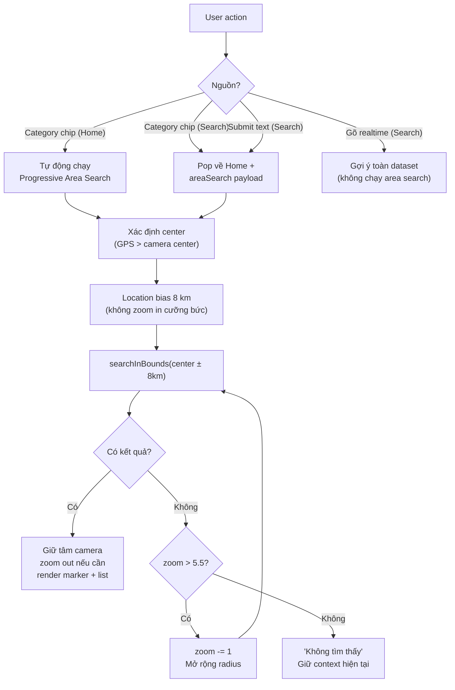

# Unified Area Search: Thống nhất luồng tìm kiếm theo vùng bán kính (v2)

## Mô tả

Thiết kế lại chức năng tìm kiếm chung (cả category và text) để **tận dụng triệt để logic tìm kiếm trong khu vực**. Category trên Home chỉ là **rút gọn quy trình** — thay vì vào search, gõ, rồi tìm → tap category = tìm kiếm nhanh. Cả hai dùng **cùng một logic**.

### Flow chung:
1. Xác định **vị trí trung tâm** (GPS nếu bật → center camera nếu GPS tắt)
2. Dùng tâm đó làm **location bias**; giữ nguyên tâm camera khi có nhiều kết
   quả, chỉ zoom out nếu vùng tìm kiếm rộng hơn viewport hiện tại.
   Chỉ kết quả duy nhất mới animate camera tới POI.
3. Với **category**, tìm trong bán kính 8 km rồi mở rộng dần theo các mức zoom
   13 → 12 → 11 → ... → 5.5 khi chưa có kết quả.
4. Với **text**, tìm local để ưu tiên gần tâm nhưng luôn merge ứng viên toàn
   dataset; location bias không phải hard boundary nên không bỏ sót địa điểm
   tên riêng ở xa.
5. Xếp hạng text theo mức độ khớp tên/địa chỉ trước, khoảng cách làm
   tie-breaker; category/nearby ưu tiên khoảng cách.
6. Chỉ **fit bounds** khi tập kết quả thực sự trải rộng (heuristic khoảng
   cách), không dùng mốc “vượt tỉnh” giả định. Nếu rỗng, giữ context camera.

### Khác biệt duy nhất giữa Home và SearchScreen:
- **Home category click**: Tự động chạy toàn bộ flow ngay lập tức
- **SearchScreen**: Gợi ý realtime **KHÔNG giới hạn** vùng bán kính. Chỉ khi
  **nhấn nút Submit** mới trả intent về Home; Home chạy progressive search
  chung và nhận kết quả cuối cùng.

### Đối chiếu với Google Places

Google mô tả `locationBias` là tín hiệu xếp hạng, không bảo đảm mọi kết quả
đều nằm trong vùng đó; Text Search mặc định ưu tiên relevance cho truy vấn
categorical, còn distance là một lựa chọn xếp hạng riêng. Vì vậy phần
progressive radius của S-Map là adaptation cần thiết cho dữ liệu offline,
nhưng text search phải có fallback toàn cục và ranking hai tầng như trên.

---

## Proposed Changes

### 1. Constants — Zoom-to-Radius Mapping

#### [MODIFY] [map_constants.dart](file:///c:/Nhat%20Nam/intern%20flutter/S-map/S-Map/lib/constants/map_constants.dart)

Thêm các constant:

```dart
/// Mức zoom bắt đầu khi area search (category/submit)
static const double areaSearchInitialZoom = 13.0;

/// Mức zoom tối thiểu — đủ hiển thị toàn bộ Việt Nam
static const double areaSearchMinZoom = 5.5;

/// Bảng ánh xạ: mức zoom → bán kính vùng tìm kiếm (km)
/// Tại Việt Nam (~lat 10-21°), mỗi bậc zoom gấp đôi diện tích
static final Map<double, double> areaSearchZoomToRadiusKm = {
  13.0: 8.0,
  12.0: 16.0,
  11.0: 32.0,
  10.0: 64.0,
  9.0: 128.0,
  8.0: 256.0,
  7.0: 500.0,
  6.0: 800.0,
  5.5: 1200.0, // bao phủ toàn bộ VN
};

/// Helper: tính LatLngBounds từ center + radius (km), sau đó phải lọc lại
/// bằng khoảng cách địa lý vì bbox là hình chữ nhật xấp xỉ.
```

---

### 2. ViewportSearchBloc — Progressive Area Search Engine

Đây là **engine chính** cho cả Home category lẫn Search submit.

#### [MODIFY] [viewport_search_event.dart](file:///c:/Nhat%20Nam/intern%20flutter/S-map/S-Map/lib/commons/blocs/viewport_search_bloc/viewport_search_event.dart)

Thêm event mới:
```dart
/// Event tìm kiếm progressive từ trung tâm, mở rộng dần khi không có kết quả
class ProgressiveAreaSearch extends ViewportSearchEvent {
  final LatLng center;
  final String? category;   // 'food', 'coffee', null cho text search
  final String? query;       // text query, null cho category search
  final double initialZoom;  // mặc định 13.0
  final int limit;

  const ProgressiveAreaSearch({
    required this.center,
    this.category,
    this.query,
    this.initialZoom = MapConstants.areaSearchInitialZoom,
    this.limit = 50,
  });
}
```

#### [MODIFY] [viewport_search_state.dart](file:///c:/Nhat%20Nam/intern%20flutter/S-map/S-Map/lib/commons/blocs/viewport_search_bloc/viewport_search_state.dart)

Thêm fields để UI biết animate camera thế nào:
```dart
final double? resolvedZoomLevel;  // Mức zoom thực tế tìm thấy kết quả
final LatLng? searchCenter;       // Tâm tìm kiếm đã sử dụng
final String? searchQuery;
final bool fitBoundsMode;         // false: nhiều kết quả không fit về POI
final bool isAreaSearch;
```

#### [MODIFY] [viewport_search_bloc.dart](file:///c:/Nhat%20Nam/intern%20flutter/S-map/S-Map/lib/commons/blocs/viewport_search_bloc/viewport_search_bloc.dart)

Thêm handler `_onProgressiveAreaSearch` (code hiện tại đã triển khai):

```dart
Future<void> _onProgressiveAreaSearch(
  ProgressiveAreaSearch event,
  Emitter<ViewportSearchState> emit,
) async {
  final gen = ++_queryGeneration;
  final category = normalizeCategory(event.category);
  final query = category == CategoryConstants.all
      ? cleanQuery(event.query)
      : null;

  emit(loading(searchCenter: event.center, category: category, query: query));

  // Lặp qua các mức zoom: 13 → 12 → 11 → ... → 5.5
  List<PoiModel> globalTextPois = const [];
  var globalTextLoaded = false;
  for (final entry in MapConstants.areaSearchZoomToRadiusKm.entries) {
    if (entry.key > event.initialZoom) continue; // bỏ qua zoom lớn hơn initial
    if (gen != _queryGeneration || emit.isDone) return;

    final bounds = MapConstants.boundsFromCenter(event.center, entry.value);
    final pois = await _poiRepository.searchInBounds(
      minLat: bounds.southwest.latitude,
      maxLat: bounds.northeast.latitude,
      minLon: bounds.southwest.longitude,
      maxLon: bounds.northeast.longitude,
      query: query,
      category: category == CategoryConstants.all ? null : category,
      limit: event.limit,
    );

    // Bbox chỉ là query window; lọc lại theo distance để bán kính là bán kính
    // thật, không phải bốn góc của hình chữ nhật.
    final radiusPois = pois
        .where((poi) => _isWithinRadius(poi, event.center, entry.value))
        .toList();
    if (query != null && !globalTextLoaded) {
      globalTextLoaded = true;
      globalTextPois = await _poiRepository.search(
        query,
        limit: event.limit < 100 ? 100 : event.limit,
      );
    }
    final candidates = [...radiusPois, ...globalTextPois];

    if (candidates.isNotEmpty) {
      final ranked = SearchResultRanker.rank(
        candidates,
        center: event.center,
        query: query,
        limit: event.limit,
      );
      emit(state.copyWith(
        status: ViewportSearchStatus.success,
        pois: ranked,
        resolvedZoomLevel: entry.key,
        searchCenter: event.center,
        // Không fit về cụm POI; Home chỉ zoom out quanh tâm camera nếu cần.
        fitBoundsMode: false,
        selectedCategory: category,
        isAreaSearch: true,
      ));
      return;
    }
  }

  // Không tìm thấy ở bất kỳ mức zoom nào
  emit(state.copyWith(
    status: ViewportSearchStatus.empty,
    pois: const [],
    resolvedZoomLevel: MapConstants.areaSearchMinZoom,
    searchCenter: event.center,
  ));
}

```

---

### 3. HomeScreenContent — Unified Category Handler

#### [MODIFY] [home_screen_content.dart](file:///c:/Nhat%20Nam/intern%20flutter/S-map/S-Map/lib/screens/main/home/widgets/home/home_screen_content.dart)

**Thay đổi `_handleCategorySelected()`** (dòng 62-76):

```dart
void _handleCategorySelected(String? cat) {
  if (cat == null) return;
  if (_activeSearchText != null &&
      exploreCubit.state.selectedCategory == cat) {
    _handleClearSearch();
    return;
  }

  final categoryTitle = tr(PoiCategoryHelper.getCategoryLocaleKey(cat));
  exploreCubit.selectCategory(cat);

  // === MỚI: Unified area search ===
  // 1. Xác định trung tâm (GPS > camera center)
  final mapState = displayCubit.state;
  final center = mapState.currentPosition ?? mapState.center ?? MapConstants.defaultLocation;

  // 2. Gọi progressive area search. Nhiều kết quả giữ tâm camera, chỉ zoom out
  // nếu bán kính đã resolve rộng hơn viewport hiện tại.
  viewportBloc.add(ProgressiveAreaSearch(
    center: center,
    category: cat,
  ));

  setState(() {
    _activeSearchText = categoryTitle;
    _showSearchThisArea = false;
  });
}
```

**Cập nhật BlocListener cho ViewportSearchBloc** (dòng 309-326) để xử lý cả
text area search và category search. Nhiều kết quả chỉ render marker/list,
không fit bounds; nếu cần thì chỉ zoom out quanh tâm camera hiện tại. Chỉ kết
quả duy nhất mới animate tới POI:

```dart
BlocListener<ViewportSearchBloc, ViewportSearchState>(
  listenWhen: (prev, curr) =>
      prev.status != curr.status ||
      prev.pois != curr.pois ||
      prev.resolvedZoomLevel != curr.resolvedZoomLevel,
  listener: (context, viewportState) {
    if (!viewportState.isAreaSearch &&
        viewportState.selectedCategory == CategoryConstants.all) return;

    final title = viewportState.selectedCategory != CategoryConstants.all
        ? tr(PoiCategoryHelper.getCategoryLocaleKey(
            viewportState.selectedCategory))
        : viewportState.searchQuery;
    if (viewportState.status == ViewportSearchStatus.success) {
      _handleSearchResults(
        viewportState.pois,
        title,
      );
      if (viewportState.isAreaSearch &&
          viewportState.pois.length > 1 &&
          viewportState.resolvedZoomLevel != null &&
          displayCubit.state.zoom > viewportState.resolvedZoomLevel!) {
        displayCubit.zoomToLevel(
          viewportState.resolvedZoomLevel!,
          center: displayCubit.state.center ?? viewportState.searchCenter,
        );
      }
    } else if (viewportState.status == ViewportSearchStatus.empty) {
      _handleSearchResults(const [], title);
    }
  },
),
```

**Cập nhật xử lý SearchResultPayload từ SearchScreen** (dòng 49-61 trong `home_header_search_bar.dart`):
- Khi nhận payload `isArea` → gọi `onAreaSearch` để Home chạy engine chung.
- Home chỉ render marker/list khi có nhiều kết quả; payload không mang kết quả
  giả/zoom cố định. Chỉ POI duy nhất mới đưa camera tới vị trí đó.

---

### 4. SearchScreenContent — Submit mới search, gợi ý không giới hạn

#### [MODIFY] [search_screen_content.dart](file:///c:/Nhat%20Nam/intern%20flutter/S-map/S-Map/lib/screens/search/widgets/search_screen_content.dart)

**`_onCategorySelected()` (dòng 46-53)** — Dùng cùng logic search submit:

```dart
void _onCategorySelected(String category) {
  _textController.text = category;
  _textController.selection = TextSelection.fromPosition(
    TextPosition(offset: category.length),
  );
  // Trả intent về Home; Home chạy progressive area search dùng chung.
  _performAreaSearch(category: category);
}
```

**`_onSubmitted()` (dòng 64-80)** — Thay đổi:

```dart
void _onSubmitted(String query) {
  final clean = query.trim();
  if (clean.isEmpty) return;
  _performAreaSearch(query: clean);
}
```

**Thêm method `_performAreaSearch()`**:

```dart
void _performAreaSearch({String? query, String? category}) {
  // Lấy center từ SearchScreen (đã nhận từ Home khi push route)
  final searchCubit = context.read<SearchCubit>();
  final center = searchCubit.state.userLocation;

  // Pop về Home với payload đặc biệt yêu cầu progressive search
  context.pop(SearchResultPayload.areaSearch(
    submittedQuery: query,
    searchCategory: category,
    searchCenter: center,
  ));
}
```

**Gợi ý realtime (onQueryChanged)**: tìm toàn dataset và chỉ dùng vị trí để
hiển thị khoảng cách/xếp hạng phụ. Không chạy progressive radius cho mỗi lần
gõ; progressive chỉ chạy sau Submit.

---

### 5. MapDisplayCubit — Thêm zoomToLevel (dùng cho thao tác camera khác)

#### [MODIFY] [map_display_cubit.dart](file:///c:/Nhat%20Nam/intern%20flutter/S-map/S-Map/lib/commons/cubits/map_display_cubit/map_display_cubit.dart)

Thêm method:

```dart
/// Zoom đến mức chỉ định, giữ trung tâm cố định. Không ghi đè
/// currentPosition (GPS) bằng tâm camera.
void zoomToLevel(double zoom, {LatLng? center}) {
  final target = center ?? state.center ?? state.currentPosition;
  if (target == null) return;
  final clampedZoom = zoom.clamp(MapConstants.minZoom, MapConstants.maxZoom);
  emit(state.copyWith(
    zoom: clampedZoom,
    center: target,
    isFollowingUser: false,
    clearError: true,
    cameraAction: MapCameraAction(
      type: MapCameraActionType.animateToPosition,
      target: target,
      zoom: clampedZoom,
      timestamp: DateTime.now().microsecondsSinceEpoch,
    ),
  ));
}
```

---

### 6. SearchResultPayload — Thêm area search payload

#### [MODIFY] [search_result_payload.dart](file:///c:/Nhat%20Nam/intern%20flutter/S-map/S-Map/lib/models/search_result_payload.dart)

Thêm constructor cho area search:

```dart
class SearchResultPayload extends Equatable {
  final PoiModel? selectedPoi;
  final List<PoiModel>? allResults;
  final String? submittedQuery;
  final String? searchCategory;    // NEW: category filter
  final LatLng? searchCenter;      // NEW: tâm tìm kiếm
  final bool isAreaSearch;         // NEW: flag yêu cầu progressive search

  // ... existing constructors ...

  const SearchResultPayload.areaSearch({
    this.submittedQuery,
    this.searchCategory,
    this.searchCenter,
  })  : selectedPoi = null,
        allResults = null,
        isAreaSearch = true;

  bool get isSingle => selectedPoi != null;
  bool get isAll => allResults != null && allResults!.isNotEmpty;
  bool get isArea => isAreaSearch;
}
```

---

### 7. HomeHeaderSearchBar — Xử lý area search payload

#### [MODIFY] [home_header_search_bar.dart](file:///c:/Nhat%20Nam/intern%20flutter/S-map/S-Map/lib/screens/main/home/widgets/home/home_header_search_bar.dart)

Cập nhật `.then((result) {...})` block (dòng 49-61) để xử lý `SearchResultPayload.areaSearch`:

```dart
.then((result) {
  if (result != null && context.mounted) {
    if (result is SearchResultPayload) {
      if (result.isArea) {
        // NEW: Area search từ SearchScreen → trigger progressive search trên Home
        onAreaSearch?.call(result);
      } else if (result.isSingle && result.selectedPoi != null) {
        onPoiSelected(result.selectedPoi!);
      } else if (result.isAll && result.allResults != null) {
        onSearchResults(result.allResults!, result.submittedQuery);
      }
    } else if (result is PoiModel) {
      onPoiSelected(result);
    }
  }
});
```

Thêm callback `onAreaSearch` vào widget params.

---

## Tóm tắt Flow



---

## Verification Plan

### Automated Tests
```bash
cd S-Map && flutter test --no-pub test/commons/utils/search_result_ranker_test.dart test/commons/blocs/viewport_search_bloc_test.dart test/commons/cubits/search_cubit_test.dart test/commons/cubits/map_display_cubit_test.dart test/commons/utils/map_symbol_manager_test.dart
```

### Manual Verification
- [ ] Click category "Ăn uống" trên Home → tìm quanh tâm GPS/camera, không zoom in cưỡng bức
- [ ] Tắt GPS → verify dùng center camera làm bias
- [ ] Search "phở" trên SearchScreen → nhấn submit → Home chạy progressive engine
- [ ] Test vùng ít POI → verify zoom giảm dần 13 → 12 → 11...
- [ ] Test vùng không có POI → mở rộng đến 5.5 rồi giữ context hiện tại
- [ ] Gợi ý realtime khi gõ → không bị giới hạn vùng
- [ ] Kết quả trải rộng → fit bounds toàn bộ tập POI, không chỉ 10 điểm đầu
- [ ] Category chip trong SearchScreen → pop về Home, chạy cùng flow
