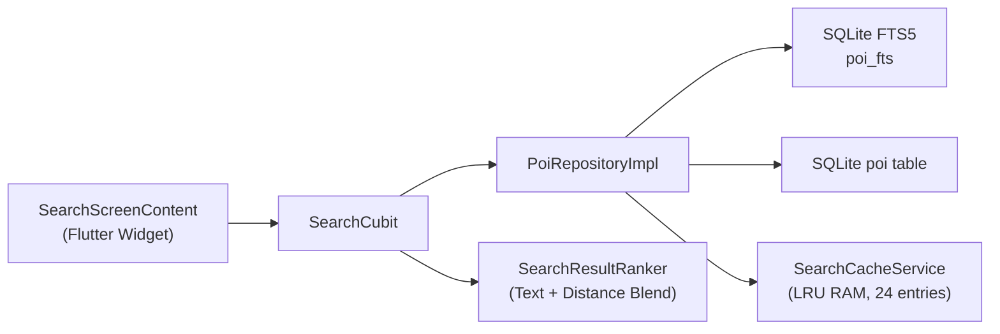
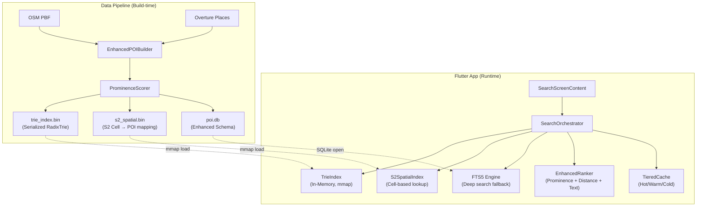
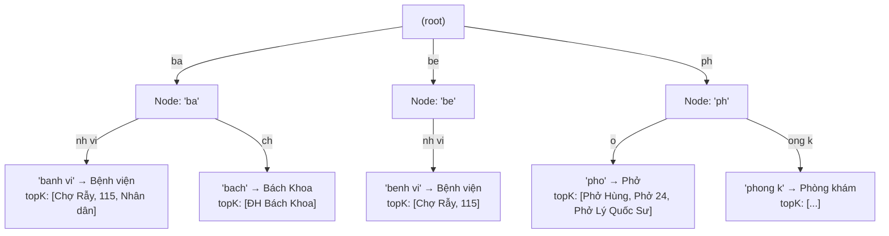
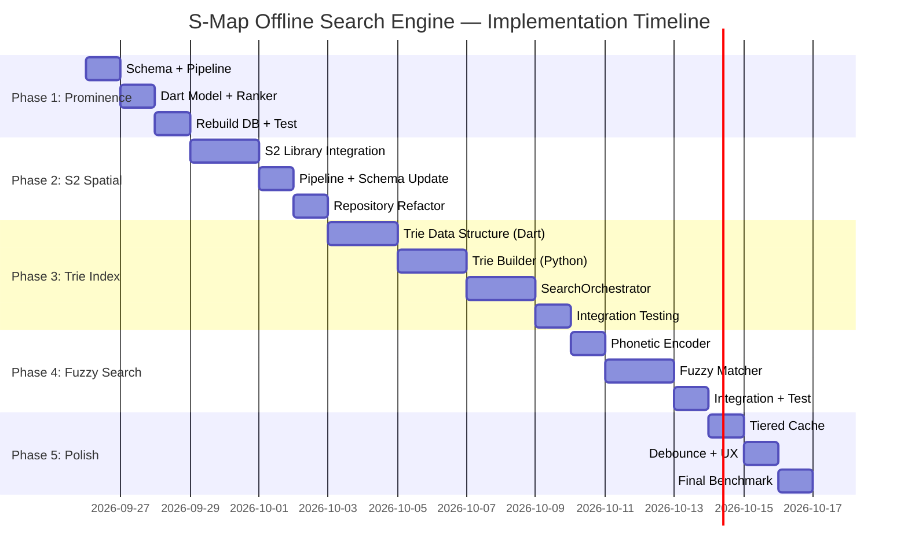

# 🗺️ S-Map Offline Search Engine — Master Plan

> **Mục tiêu**: Xây dựng hệ thống tìm kiếm offline đạt 100% trải nghiệm Google Maps — autocomplete tức thì (<5ms), xếp hạng thông minh theo vị trí + độ nổi bật, và gợi ý chính xác ngay từ ký tự đầu tiên.

## 🔎 Review & Điều Chỉnh Khi Triển Khai

Plan gốc đúng về hướng kiến trúc nhưng có ba điểm cần điều chỉnh để phù hợp
với codebase hiện tại và tránh tăng rủi ro không cần thiết:

1. **Prominence là phase bắt buộc đầu tiên**: triển khai build-time, giữ mặc định
   `0` để đọc được DB cũ; ranking chỉ dùng prominence làm tie-breaker ở nhóm
   partial/category, không được lấn át exact match.
2. **Chưa thêm dependency S2 ở phase này**: DB hiện đã có R*Tree nhưng
   `searchInBounds` chưa dùng nó. Ta tận dụng R*Tree trước; S2 chỉ được bật sau
   benchmark thực tế chứng minh R*Tree không đủ nhanh. Việc lưu S2 cell bằng
   range scan cũng cần kiểm chứng kỹ vì cell covering có thể ở nhiều level.
3. **Trie dùng binary asset + isolate-ready loader, chưa mmap/FFI**: Flutter
   Android/iOS không có một API mmap thuần Dart thống nhất. Pure Dart với top-K
   pruning phù hợp cho khoảng 89K POI hiện tại; chỉ chuyển sang mmap/FFI khi
   profiling trên thiết bị yếu chứng minh cần thiết.
4. **Chuẩn hóa tiếng Việt phải bảo toàn nghĩa**: Trie chính chỉ bỏ dấu,
   không gộp `ch/tr` hoặc `s/x`. Khóa ngữ âm nằm ở Trie fallback riêng và chỉ
   được dùng khi tìm chính xác không có kết quả, tránh tạo false positive.

Phạm vi thực thi hiện tại là Phase 1, spatial R*Tree, Phase 3 pure Dart,
Phase 4 conservative fuzzy matching và Phase 5 debouncer/orchestrator. Mọi
đường đi đều có fallback FTS5/LIKE nên app vẫn hoạt động khi binary index
   chưa được đóng gói hoặc bị lỗi.

### Trạng thái triển khai

- ✅ Prominence schema, pipeline scoring, model và ranker.
- ✅ R*Tree được dùng thật trong `searchInBounds`; S2 dependency để phase sau.
- ✅ Radix trie binary builder/loader, top-K pruning và SearchOrchestrator.
- ✅ Fuzzy matching bảo thủ cho typo ngắn, phonetic key và progressive debouncer.
- ✅ Tách strict Vietnamese normalization khỏi phonetic fallback để không làm sai kết quả chính.
- ✅ Asset `poi.db` đã migrate và `trie_index.bin` đã build.
- ✅ Full Flutter test suite: 630 tests passed; `flutter analyze`: no issues.

---

## 📊 Phân Tích Hiện Trạng (AS-IS)

### Kiến trúc hiện tại



### Các file liên quan

| Layer | File | Vai trò |
|-------|------|---------|
| **Data Pipeline** | [build_poi_database.py](file:///c:/Nhat%20Nam/intern%20flutter/S-map/S-Map/data-pipeline/build_poi_database.py) | Tạo SQLite DB từ OSM + Overture |
| **DB Service** | [poi_database_service.dart](file:///c:/Nhat%20Nam/intern%20flutter/S-map/S-Map/lib/services/poi_database_service.dart) | Quản lý lifecycle SQLite |
| **Repository** | [poi_repository.dart](file:///c:/Nhat%20Nam/intern%20flutter/S-map/S-Map/lib/repos/poi_repository.dart) | FTS5 queries, LIKE fallback, dedup |
| **Ranker** | [search_result_ranker.dart](file:///c:/Nhat%20Nam/intern%20flutter/S-map/S-Map/lib/commons/utils/search_result_ranker.dart) | Tiered scoring (Text + Distance) |
| **Cache** | [search_cache_service.dart](file:///c:/Nhat%20Nam/intern%20flutter/S-map/S-Map/lib/services/search_cache_service.dart) | LRU cache 24 entries |
| **Model** | [poi_model.dart](file:///c:/Nhat%20Nam/intern%20flutter/S-map/S-Map/lib/models/poi_model.dart) | POI data class |

### Điểm mạnh đã có ✅
- FTS5 full-text search với BM25 ranking
- R*Tree spatial indexing (đã build trong pipeline)
- Unicode NFC normalization cho tiếng Việt
- Tiered text scoring (Exact → Prefix → Partial)
- Distance decay blending
- Search cache (LRU)
- Admin aliases cho tên hành chính cũ/mới

### Điểm yếu cần khắc phục ❌
| Vấn đề | Hậu quả | Google Maps giải quyết thế nào |
|---------|---------|-------------------------------|
| FTS5 disk-based, latency ~20-80ms | Autocomplete giật với mỗi keystroke | In-memory Trie, O(p) lookup |
| Không có Prominence Score | "Phở Hùng" 10km = "Phở lề đường" 100m | Static prominence pre-computed |
| R*Tree chưa dùng trong search | `searchInBounds` vẫn dùng `lat >= ? AND lat <= ?` | S2 Cell spatial partitioning |
| Không có Keyboard-Aware Ranking | Gõ "l" → 500k kết quả random | Frequency-weighted trie + proximity |
| Cache chỉ 24 entries | Cold start mỗi lần mở app | Persistent trie index file |
| Chưa có Fuzzy/Typo tolerance | "bênh viên" → 0 kết quả | Edit distance + phonetic matching |

---

## 🏗️ Kiến Trúc Mới (TO-BE)



---

## 📋 Kế Hoạch Triển Khai — 5 Phase

---

### Phase 1: Prominence Score & Enhanced Schema
**Thời gian ước tính**: 2-3 ngày
**Rủi ro**: Thấp — Chỉ thay đổi pipeline + thêm cột DB
**Giá trị**: Cao — Kết quả search ngay lập tức thông minh hơn

#### 1.1 Thêm cột `prominence` vào POI schema

```diff
 # data-pipeline/build_poi_database.py
 CREATE TABLE poi (
     id INTEGER PRIMARY KEY AUTOINCREMENT,
     osm_id TEXT,
     name TEXT NOT NULL,
     name_ascii TEXT NOT NULL,
     category TEXT,
     sub_category TEXT,
     lat REAL NOT NULL,
     lon REAL NOT NULL,
     address TEXT,
     address_ascii TEXT,
     street TEXT,
     housenumber TEXT,
     city TEXT,
-    admin_aliases TEXT
+    admin_aliases TEXT,
+    prominence INTEGER DEFAULT 0
 );
```

#### 1.2 Prominence Scoring Algorithm (Python, build-time)

```python
# Công thức tính prominence tĩnh từ OSM tags
def calculate_prominence(tags: dict, category: str, sub_category: str) -> int:
    score = 0
    
    # Tier 1: Category-based base score (0-100)
    CATEGORY_WEIGHTS = {
        'hospital': 90, 'airport': 95, 'university': 85,
        'school': 70, 'bank': 60, 'atm': 50,
        'gas': 55, 'hotel': 65, 'food': 40,
        'coffee': 35, 'shop': 30, 'park': 50,
        'transportation': 80, 'tourism': 60,
        'address': 5, 'street': 10,
    }
    score += CATEGORY_WEIGHTS.get(category, 20)
    
    # Tier 2: Metadata completeness bonus (0-30)
    if tags.get('wikipedia') or tags.get('wikidata'):
        score += 30  # Notable entity
    if tags.get('website') or tags.get('contact:website'):
        score += 10
    if tags.get('phone') or tags.get('contact:phone'):
        score += 5
    if tags.get('opening_hours'):
        score += 5
    
    # Tier 3: Name quality (0-20)
    name = tags.get('name', '')
    if tags.get('name:vi'):
        score += 10  # Có tên tiếng Việt chính thức
    if len(name) > 3:
        score += 5
    if tags.get('brand'):
        score += 15  # Thương hiệu lớn
    
    # Tier 4: Overture confidence bonus
    confidence = tags.get('_confidence')
    if confidence and confidence > 0.8:
        score += 10
    
    return min(score, 255)  # Cap at uint8
```

#### 1.3 Cập nhật PoiModel (Dart)

```diff
 // lib/models/poi_model.dart
 class PoiModel {
   final int? id;
   // ... existing fields ...
   final String? city;
+  final int prominence;

   const PoiModel({
     // ... existing params ...
     this.city,
+    this.prominence = 0,
   });

   factory PoiModel.fromMap(Map<String, dynamic> map) {
     return PoiModel(
       // ... existing parsing ...
       city: map['city']?.toString(),
+      prominence: (map['prominence'] as num?)?.toInt() ?? 0,
     );
   }
 }
```

#### 1.4 Tích hợp Prominence vào SearchResultRanker

```diff
 // lib/commons/utils/search_result_ranker.dart
 static double _blendScore({
   required double textScore,
   required double? distanceKm,
   required bool hasQuery,
+  required int prominence,
 }) {
   // ... existing tiers ...
   
   // Tier 3: Partial/Token Match — Prominence giờ là yếu tố quyết định
   final geoBonus = distanceKm != null
       ? 1200.0 / (1.0 + 0.05 * distanceKm)
       : 600.0;
-  return textScore + geoBonus;
+  final prominenceBonus = prominence * 3.0; // 0-765 điểm
+  return textScore + geoBonus + prominenceBonus;
 }
```

#### Deliverables Phase 1
- [ ] `build_poi_database.py` — Thêm `calculate_prominence()` + cột `prominence`
- [ ] `poi_model.dart` — Thêm field `prominence`
- [ ] `search_result_ranker.dart` — Tích hợp prominence vào `_blendScore()`
- [ ] `poi_repository.dart` — Truyền prominence từ DB query results
- [ ] Rebuild database: `python build_poi_database.py`
- [ ] Test: Chạy benchmark, verify "Bệnh viện Chợ Rẫy" xếp trên "Phòng khám tư" khi search "bệnh viện"

---

### Phase 2: S2 Spatial Indexing
**Thời gian ước tính**: 3-4 ngày
**Rủi ro**: Trung bình — Cần integrate S2 library
**Giá trị**: Cao — "Nearby" search cực nhanh, tận dụng được R*Tree đã build

#### 2.1 Thêm dependency `s2geometry`

```yaml
# pubspec.yaml
dependencies:
  s2geometry: ^1.0.0  # Dart port của Google S2 Geometry
```

#### 2.2 Thêm cột S2 Cell ID vào POI schema

```diff
 CREATE TABLE poi (
     ...
     prominence INTEGER DEFAULT 0,
+    s2_cell_id INTEGER  -- S2 Cell ID level 16 (~150m cells)
 );
+
+CREATE INDEX idx_poi_s2_cell ON poi(s2_cell_id);
```

```python
# data-pipeline: Tính S2 Cell ID cho mỗi POI
import s2sphere  # pip install s2sphere

def compute_s2_cell_id(lat: float, lon: float, level: int = 16) -> int:
    """Level 16 = ~150m cell, đủ chính xác cho POI lookup."""
    ll = s2sphere.LatLng.from_degrees(lat, lon)
    cell = s2sphere.CellId.from_lat_lng(ll).parent(level)
    return cell.id()
```

#### 2.3 S2SpatialIndex Service (Dart)

```dart
// lib/services/s2_spatial_index.dart
import 'package:s2geometry/s2geometry.dart';

class S2SpatialIndex {
  /// Lấy danh sách S2 Cell ID covering một viewport/radius
  static List<int> getCoveringCellIds({
    required double centerLat,
    required double centerLon,
    required double radiusKm,
    int maxCells = 8,
  }) {
    final center = S2LatLng.fromDegrees(centerLat, centerLon);
    final cap = S2Cap.fromAxisAngle(
      center.toPoint(),
      S1Angle.fromRadians(radiusKm / 6371.0),
    );
    final coverer = S2RegionCoverer(maxCells: maxCells);
    final covering = coverer.getCovering(cap);
    return covering.cellIds.map((c) => c.id).toList();
  }
  
  /// SQL WHERE clause cho S2 range scan
  static String buildS2WhereClause(List<int> cellIds) {
    final ranges = cellIds.map((id) {
      final cell = S2CellId(id);
      return '(s2_cell_id BETWEEN ${cell.rangeMin.id} AND ${cell.rangeMax.id})';
    });
    return ranges.join(' OR ');
  }
}
```

#### 2.4 Tích hợp vào PoiRepository — thay thế searchInBounds

```dart
// Thay vì:  lat >= ? AND lat <= ? AND lon >= ? AND lon <= ?
// Dùng:     s2_cell_id BETWEEN ? AND ?
// → Tận dụng B-Tree index trên s2_cell_id, nhanh hơn nhiều
@override
Future<List<PoiModel>> searchInBounds({...}) async {
  final cellIds = S2SpatialIndex.getCoveringCellIds(
    centerLat: (minLat + maxLat) / 2,
    centerLon: (minLon + maxLon) / 2,
    radiusKm: _estimateRadiusKm(minLat, maxLat, minLon, maxLon),
  );
  final s2Where = S2SpatialIndex.buildS2WhereClause(cellIds);
  // ... query with s2Where ...
}
```

#### Deliverables Phase 2
- [ ] `pubspec.yaml` — Thêm `s2geometry` dependency
- [ ] `build_poi_database.py` — Tính + lưu `s2_cell_id` cho mỗi POI
- [ ] `lib/services/s2_spatial_index.dart` — S2 covering utility
- [ ] `poi_repository.dart` — Refactor `searchInBounds` dùng S2
- [ ] Test: Benchmark so sánh lat/lon range vs S2 range scan

---

### Phase 3: In-Memory Prefix Trie (Core Innovation)
**Thời gian ước tính**: 5-7 ngày
**Rủi ro**: Cao — Đây là phần phức tạp nhất
**Giá trị**: Cực cao — Autocomplete <5ms, giống Google Maps

> [!IMPORTANT]
> Đây là thành phần then chốt, biến S-Map từ "FTS5 search" thành "Google Maps-level autocomplete".

#### 3.1 Kiến trúc Radix Trie



#### 3.2 Trie Node Structure

```dart
// lib/search_engine/radix_trie.dart

class TrieNode {
  /// Edge label (compressed path)
  String edge;
  
  /// Children mapped by first character
  Map<int, TrieNode>? children;
  
  /// Top-K POI IDs sorted by prominence (pruning trie)
  /// Chỉ lưu ID, không lưu full PoiModel → tiết kiệm RAM
  List<int>? topKPoiIds;
  
  /// Maximum prominence of any descendant (for pruning)
  int maxDescendantProminence;
  
  TrieNode({
    required this.edge,
    this.children,
    this.topKPoiIds,
    this.maxDescendantProminence = 0,
  });
}
```

#### 3.3 Trie Builder (Python, build-time)

```python
# data-pipeline/build_trie_index.py

class RadixTrieBuilder:
    """Build a binary-serialized Radix Trie from POI database."""
    
    TOP_K = 10  # Số POI ID lưu tại mỗi node
    
    def __init__(self, db_path: Path):
        self.root = TrieNode()
        self._load_pois(db_path)
    
    def _load_pois(self, db_path):
        """Load tất cả POI, insert vào trie theo name_ascii."""
        conn = sqlite3.connect(str(db_path))
        cursor = conn.execute(
            "SELECT id, name_ascii, prominence FROM poi ORDER BY prominence DESC"
        )
        for poi_id, name_ascii, prominence in cursor:
            # Insert cả tên gốc và từng token
            tokens = self._tokenize(name_ascii)
            for token in tokens:
                self._insert(token, poi_id, prominence)
            # Insert full name
            self._insert(name_ascii.lower(), poi_id, prominence)
        conn.close()
    
    def _insert(self, key: str, poi_id: int, prominence: int):
        """Insert key vào Radix Trie, maintain top-K at each node."""
        # ... radix trie insertion with path compression ...
        # At each node along the path, update maxDescendantProminence
        # and maintain topK list
    
    def serialize(self, output_path: Path):
        """Serialize trie thành binary format cho mmap loading."""
        # Format: [node_count][node_0][node_1]...[node_n]
        # Each node: [edge_len:u16][edge_bytes][children_count:u16]
        #            [child_first_char:u8, child_offset:u32]...
        #            [top_k_count:u8][poi_id:u32, prominence:u8]...
        #            [max_descendant_prominence:u8]
        pass
```

#### 3.4 Trie Loader (Dart, runtime)

```dart
// lib/search_engine/trie_index.dart

class TrieIndex {
  static TrieIndex? _instance;
  late final TrieNode _root;
  
  /// Load trie từ binary file (async, chạy trong Isolate)
  static Future<TrieIndex> load(String filePath) async {
    if (_instance != null) return _instance!;
    _instance = await Isolate.run(() => _loadFromFile(filePath));
    return _instance!;
  }
  
  /// Prefix search: O(p) where p = prefix length
  /// Returns top-K POI IDs sorted by prominence
  List<int> prefixSearch(String prefix, {int limit = 10}) {
    final node = _findNode(prefix);
    if (node == null) return const [];
    return node.topKPoiIds?.take(limit).toList() ?? const [];
  }
  
  TrieNode? _findNode(String prefix) {
    // Traverse radix trie following prefix characters
    // O(p) time complexity
  }
}
```

#### 3.5 Quyết định: Pure Dart vs C++ FFI

| Yếu tố | Pure Dart | C++ FFI |
|---------|-----------|---------|
| **Build complexity** | Thấp | Cao (CMake, platform-specific) |
| **Performance** | ~1-5ms prefix lookup | ~0.1-0.5ms prefix lookup |
| **Memory** | Dart GC overhead | Zero-copy, controlled |
| **Maintenance** | Dễ | Khó (ABI, platform builds) |
| **Đủ cho S-Map?** | ✅ Có (với ~500K POIs) | Cần nếu >5M POIs |

> [!TIP]
> **Recommendation**: Bắt đầu với **Pure Dart** (Phase 3a), profile thực tế. Nếu latency > 10ms trên thiết bị yếu → migrate sang C++ FFI (Phase 3b). Với dữ liệu Việt Nam (~500K POIs), Dart đủ nhanh.

#### 3.6 Integration vào SearchOrchestrator

```dart
// lib/search_engine/search_orchestrator.dart

class SearchOrchestrator {
  final TrieIndex _trieIndex;
  final IPoiRepository _poiRepo;
  final SearchResultRanker _ranker;

  /// Chiến lược search 3 tầng (giống Google Maps)
  Future<List<PoiModel>> search({
    required String query,
    LatLng? userLocation,
    int limit = 20,
  }) async {
    final asciiQuery = AppUtils.instance.toAscii(query).toLowerCase();
    
    // === TẦNG 1: Trie Instant Results (< 5ms) ===
    // Trả về ngay khi user gõ 1-2 ký tự
    final triePoiIds = _trieIndex.prefixSearch(asciiQuery, limit: limit);
    
    if (triePoiIds.isNotEmpty) {
      final triePois = await _poiRepo.getPoisByIds(triePoiIds);
      final ranked = SearchResultRanker.rank(
        triePois,
        center: userLocation,
        query: query,
        limit: limit,
      );
      
      // Nếu đủ kết quả chất lượng cao → return ngay
      if (ranked.length >= limit || query.length <= 2) {
        return ranked;
      }
    }
    
    // === TẦNG 2: FTS5 Deep Search (20-80ms) ===
    // Kích hoạt khi query >= 3 ký tự hoặc trie thiếu kết quả
    final ftsResults = await _poiRepo.search(query, limit: limit * 2);
    
    // === TẦNG 3: Merge & Re-rank ===
    final allResults = _mergeAndDedup(triePoiIds, ftsResults);
    return SearchResultRanker.rank(
      allResults,
      center: userLocation,
      query: query,
      limit: limit,
    );
  }
}
```

#### Deliverables Phase 3
- [ ] `data-pipeline/build_trie_index.py` — Trie builder + binary serializer
- [ ] `lib/search_engine/radix_trie.dart` — Radix Trie data structure
- [ ] `lib/search_engine/trie_index.dart` — Binary loader + prefix search
- [ ] `lib/search_engine/search_orchestrator.dart` — 3-tier search strategy
- [ ] `poi_repository.dart` — Thêm `getPoisByIds(List<int>)` method
- [ ] Test: Benchmark <5ms cho prefix search trên thiết bị thật
- [ ] Trie binary file đóng gói cùng download package

---

### Phase 4: Fuzzy Search & Typo Tolerance
**Thời gian ước tính**: 3-4 ngày
**Rủi ro**: Trung bình
**Giá trị**: Trung bình-Cao — UX mượt mà hơn

#### 4.1 Vietnamese Phonetic Matching

```dart
// lib/search_engine/vn_phonetic_encoder.dart

/// Nhóm các âm phát âm giống nhau trong tiếng Việt
class VnPhoneticEncoder {
  static const Map<String, String> _phoneticGroups = {
    // Nguyên âm gần nhau
    'a': 'a', 'ă': 'a', 'â': 'a',
    'e': 'e', 'ê': 'e',
    'o': 'o', 'ô': 'o', 'ơ': 'o',
    'u': 'u', 'ư': 'u',
    // Phụ âm thường nhầm
    'd': 'd', 'đ': 'd',    // "d" và "đ"
    'gi': 'z', 'z': 'z',    // "gi" = "z"
    'ch': 'c', 'tr': 'c',   // "ch" ≈ "tr" (phương ngữ)
    'x': 's', 's': 's',     // "x" ≈ "s"
    'n': 'n', 'l': 'l',     // "n" ≈ "l" (phương ngữ miền Bắc)
  };
  
  /// Mã hóa phonetic cho fuzzy matching
  static String encode(String input) {
    // Bỏ dấu thanh → giữ nguyên âm gốc → áp dụng phonetic groups
    var result = _removeTones(input.toLowerCase());
    for (final entry in _phoneticGroups.entries) {
      result = result.replaceAll(entry.key, entry.value);
    }
    return result;
  }
}
```

#### 4.2 Edit Distance (Levenshtein) cho short queries

```dart
// lib/search_engine/fuzzy_matcher.dart

class FuzzyMatcher {
  /// Cho phép tối đa 1 ký tự sai với query <= 5 chars,
  /// 2 ký tự sai với query > 5 chars
  static int maxEditDistance(String query) {
    if (query.length <= 3) return 0;  // Quá ngắn → không fuzzy
    if (query.length <= 5) return 1;
    return 2;
  }
  
  /// Trie-integrated fuzzy search
  /// Duyệt trie với DFS, cho phép branching khi edit distance < max
  static List<int> fuzzyPrefixSearch(
    TrieNode root,
    String query, {
    int limit = 10,
  }) {
    final maxDist = maxEditDistance(query);
    final results = <(int poiId, int distance, int prominence)>[];
    _dfs(root, query, 0, 0, maxDist, results);
    
    // Sort by: distance ASC, prominence DESC
    results.sort((a, b) {
      final distCmp = a.$2.compareTo(b.$2);
      if (distCmp != 0) return distCmp;
      return b.$3.compareTo(a.$3);
    });
    
    return results.take(limit).map((r) => r.$1).toList();
  }
}
```

#### 4.3 Trie node thêm phonetic edge

```python
# Build-time: Insert cả phonetic-encoded key vào trie
for poi in pois:
    # Original ASCII key
    trie.insert(poi['name_ascii'], poi['id'], poi['prominence'])
    # Phonetic key (fuzzy)
    phonetic_key = vn_phonetic_encode(poi['name_ascii'])
    if phonetic_key != poi['name_ascii']:
        trie.insert(phonetic_key, poi['id'], poi['prominence'])
```

#### Deliverables Phase 4
- [ ] `lib/search_engine/vn_phonetic_encoder.dart`
- [ ] `lib/search_engine/fuzzy_matcher.dart`
- [ ] Tích hợp phonetic keys vào trie builder
- [ ] Test: "bênh viên" → "Bệnh viện", "ca fe" → "Cà phê"

---

### Phase 5: Tiered Caching & Performance Polish
**Thời gian ước tính**: 2-3 ngày
**Rủi ro**: Thấp
**Giá trị**: Trung bình — Tối ưu trải nghiệm tổng thể

#### 5.1 Tiered Cache Architecture

```dart
// lib/services/tiered_search_cache.dart

class TieredSearchCache {
  /// Hot Cache: 50 recent queries → instant replay
  final LruCache<String, List<PoiModel>> _hotCache;
  
  /// Warm Cache: Prefix → POI IDs từ trie (persistent across sessions)
  final Map<String, List<int>> _warmCache;
  
  /// Cold Cache: Full FTS results (existing SearchCacheService)
  final SearchCacheService _coldCache;
  
  List<PoiModel>? get(String query) {
    // 1. Check hot cache (O(1))
    final hot = _hotCache.get(query);
    if (hot != null) return hot;
    
    // 2. Check warm cache (prefix match)
    final warmKey = _findLongestWarmPrefix(query);
    if (warmKey != null) return _resolveWarmResults(warmKey);
    
    // 3. Fall through to cold/fresh search
    return null;
  }
}
```

#### 5.2 Debounce & Progressive Loading

```dart
// lib/search_engine/search_debouncer.dart

class SearchDebouncer {
  Timer? _timer;
  String _lastQuery = '';
  
  /// Progressive strategy:
  /// - 0-1 chars: Trie only, no debounce (instant)  
  /// - 2-3 chars: Trie + 150ms debounce for FTS
  /// - 4+ chars:  Trie instant + 300ms debounce for FTS deep search
  void onQueryChanged(String query, Function(String) callback) {
    _lastQuery = query;
    
    if (query.length <= 1) {
      // Instant trie results, no FTS
      callback(query);
      return;
    }
    
    // Show trie results immediately
    callback(query);
    
    // Debounce FTS deep search
    _timer?.cancel();
    final delay = query.length <= 3 ? 150 : 300;
    _timer = Timer(Duration(milliseconds: delay), () {
      if (_lastQuery == query) {
        callback(query); // Trigger FTS pass
      }
    });
  }
}
```

#### 5.3 Startup Optimization

```dart
// App startup: Load trie index in background isolate
Future<void> _initSearchEngine() async {
  // Load trie concurrently with other init tasks
  final trieFuture = TrieIndex.load(trieFilePath);
  final dbFuture = PoiDatabaseServiceImpl.instance.openDatabaseInstance();
  
  await Future.wait([trieFuture, dbFuture]);
  
  // SearchOrchestrator ready
  _searchOrchestrator = SearchOrchestrator(
    trieIndex: await trieFuture,
    poiRepo: PoiRepositoryImpl(),
  );
}
```

#### Deliverables Phase 5
- [ ] `lib/services/tiered_search_cache.dart`
- [ ] `lib/search_engine/search_debouncer.dart`
- [ ] Startup optimization (parallel trie + DB loading)
- [ ] End-to-end benchmark trên thiết bị thật

---

## 📊 Metrics & Success Criteria

| Metric | Hiện tại | Target Phase 1 | Target Phase 3 | Target Phase 5 |
|--------|---------|----------------|----------------|----------------|
| **Prefix autocomplete latency** | ~50-80ms | ~40-60ms | **< 5ms** | **< 3ms** |
| **"bệnh viện" → Chợ Rẫy rank** | #5-10 | **#1-3** | #1-3 | #1-3 |
| **1-char search quality** | Random | Random | **Top nearby POIs** | Top nearby POIs |
| **Typo tolerance** | None | None | None | **"bênh viên" works** |
| **Cold start time** | ~200ms | ~200ms | ~400ms (trie load) | **~300ms (optimized)** |
| **RAM overhead** | ~2MB | ~2MB | **~15-25MB (trie)** | ~15-25MB |
| **APK size increase** | 0 | ~0.1MB | **~5-8MB (trie.bin)** | ~5-8MB |

---

## 🗓️ Timeline Tổng Hợp



**Tổng thời gian**: ~18-22 ngày làm việc

---

## ⚠️ Rủi Ro & Mitigation

| Rủi ro | Xác suất | Impact | Mitigation |
|--------|---------|--------|------------|
| Trie quá lớn (RAM > 50MB) | Trung bình | Cao | Nén edge labels, giới hạn topK=5, chuyển C++ FFI |
| S2 Dart package chưa stable | Thấp | Trung bình | Fallback về R*Tree SQL query hiện tại |
| Trie load chậm trên thiết bị yếu | Thấp | Trung bình | mmap lazy loading, chỉ load hot region |
| DB migration breaking change | Thấp | Cao | Backward compatible: `prominence DEFAULT 0` |

---

## 🔑 Nguyên Tắc Thiết Kế (Design Principles)

1. **Incremental Enhancement**: Mỗi phase tự đứng được, không phá vỡ code hiện tại
2. **Graceful Degradation**: Nếu trie chưa load xong → fallback về FTS5 bình thường
3. **Build-time > Runtime**: Tính toán nặng (prominence, trie, S2) ở pipeline, không ở runtime
4. **Measure First**: Profile trước khi optimize — Pure Dart trước, C++ FFI chỉ khi cần
5. **Tái sử dụng tối đa**: Tận dụng `SearchResultRanker`, `PoiRepository`, `SearchCacheService` hiện có

> [!NOTE]
> Plan này được thiết kế để **tận dụng 100% công trình của Google Maps** trong giới hạn open-source (S2 Geometry, Trie indexing, Prominence scoring, Spatial partitioning) — tất cả đều là kỹ thuật đã được Google public trong papers và open-source libraries.
